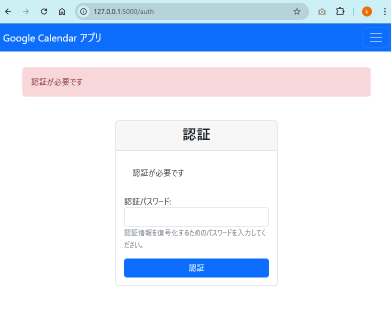
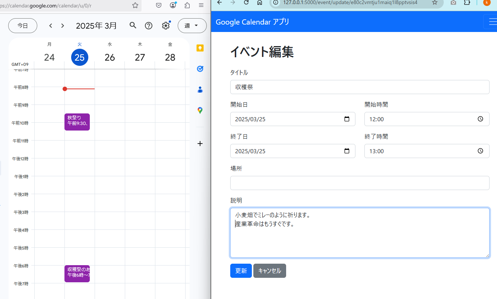

# Google Calendar アプリ

Flaskを使用したシンプルなGoogle Calendarイベント管理アプリケーションです。サービスアカウントを使用してGoogleカレンダーのイベントを表示、作成、編集、削除できます。

## 機能

- Googleカレンダーのイベント一覧表示
- イベントの詳細表示
- 新規イベントの作成
- 既存イベントの編集
- イベントの削除
- 認証情報の暗号化と保護（配布用）

## スクリーンショット

### 認証画面
認証情報を復号化するためのパスワードを入力します。(PyInstallerで exe 化した場合のみ)



### イベント編集画面
イベントの詳細を編集できます。



## 前提条件

- Python 3.9以上
- Google Cloud Platformのプロジェクトとサービスアカウント
- Google Calendar APIの有効化

## インストール

1. リポジトリをクローン:
```
git clone <リポジトリURL>
cd demo_calendar-gui
```

2. 必要なパッケージをインストール:
```
pip install -r requirements.txt
```

3. `credentials`ディレクトリに認証情報を設定:
   - **重要**: 詳細な手順は`credentials/README.md`を参照してください
   - 必要なファイル:
     - サービスアカウントのJSONキーファイル（Google Cloud Platformから取得）
     - `config.json` (カレンダー設定)
   
   **セキュリティ注意**: 認証情報ファイルは`.gitignore`によってリポジトリから除外されます。絶対にGitHubにコミットしないでください。

4. 環境変数の設定:
```
# .envファイルを作成
SECRET_KEY=your_secret_key_here
FLASK_DEBUG=False
```

## 実行方法

開発環境での実行:
```
python -m app
```

アプリケーションが http://127.0.0.1:5000 で起動します。

**注意**: 開発環境で実行する場合は、認証は必要なく、`credentials`ディレクトリの認証情報が直接使用されます。一方、exeファイルで実行する場合は、暗号化された認証情報を復号化するためのパスワード認証が必要です。

## 配布用exeファイルの作成と利用

### 認証情報の暗号化

アプリケーションを配布する際に認証情報を保護するため、暗号化機能が実装されています。

1. 暗号化モジュールのインストール:
```
pip install cryptography
```

2. 認証情報の暗号化:
```
python encrypt_credentials.py
```

このコマンドを実行すると、`credentials`ディレクトリの内容が暗号化され、`encrypted_credentials`ディレクトリに保存されます。暗号化の際にパスワードの設定を求められます。

### 暗号化パスワードの変更

すでに暗号化された認証情報のパスワードを変更するには、以下のスクリプトを使用します：

```
python change_password.py
```

このスクリプトを実行すると、以下の手順でパスワードが変更されます：
1. 現在のパスワードを入力して確認
2. 現在のパスワードで認証情報を復号化
3. 新しいパスワードを設定
4. 新しいパスワードで認証情報を再暗号化

変更前の暗号化ディレクトリは`encrypted_credentials.bak`にバックアップされます。

### PyInstallerでのexeファイル作成

1. PyInstallerのインストール:
```
pip install pyinstaller
```

2. 単一の実行可能ファイルを作成:
```
pyinstaller --onefile --add-data "templates;templates" --add-data "encrypted_credentials;encrypted_credentials" --add-data ".env;." app.py
```

3. 作成されたexeファイルは`dist`ディレクトリに保存されます。

### exeファイルの使用方法

1. 配布されたexeファイルを実行すると、最初に認証画面が表示されます。
2. 暗号化時に設定したパスワードを入力すると、認証情報が復号化されます。
3. その後、コマンドラインウィンドウにFlaskサーバーが起動したことが表示されます。
4. ブラウザを起動して `http://127.0.0.1:5000` にアクセスします。
5. ブラウザでアクセスすると、Google Calendarのイベントを管理できるWebインターフェースが表示されます。
6. 終了するには、コマンドラインウィンドウを閉じるか、Ctrl+Cを押してFlaskサーバーを停止してください。

## セキュリティについて

- 認証情報は暗号化されており、パスワードなしでは復号化できません。
- 暗号化には業界標準のFernet対称暗号化方式を使用しています。
- パスワードからキーを導出する際に、セキュアなPBKDF2-HMAC-SHA256を使用しています。

## 注意事項

- 配布用exeファイルにパスワードを含めないでください。
- 本番環境では適切なセキュリティポリシーに従ってパスワードを管理してください。
- このアプリケーションはローカルでの使用を前提としています。